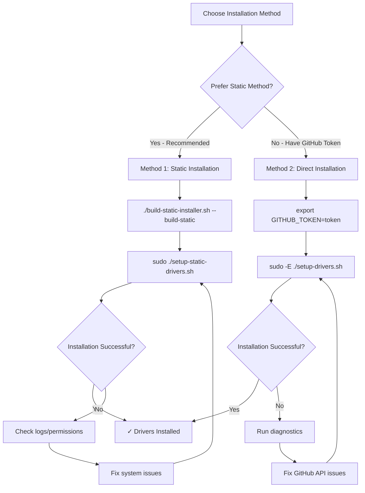

# Intel AI PC Linux Setup

This repository contains scripts to set up Intel GPU and NPU drivers on Ubuntu 24.04 for AI PC platforms.

## Overview

The setup consists of several scripts to provide flexible driver installation options:
- **`setup-drivers.sh`**: Main driver installation script (requires root privileges and GitHub API access)
- **`setup-static-drivers.sh`**: Static driver installation script (generated file, no API dependencies)
- **`verify_connectivity.sh`**: Diagnostic tool for troubleshooting GitHub API connectivity issues
- **`build-static-installer.sh`**: Tool to build static driver installers with compatibility checking

## Installation Methods

You have **two options** for installing Intel GPU and NPU drivers:

### Option 1: Two-Step Static Installation (⭐ **RECOMMENDED**)

The preferred method that avoids API rate limits and provides maximum reliability:

```bash
# Step 1: Build static installer with compatibility checking
./build-static-installer.sh --build-static

# Step 2: Run the generated static installer
sudo ./setup-static-drivers.sh
```

**Benefits of the static method:**
- ✅ **No GitHub API rate limits**
- ✅ **No need for GitHub token**
- ✅ **Faster installation** (direct downloads)
- ✅ **More reliable** (no API dependencies)
- ✅ **Version compatibility verified**
- ✅ **Can be run offline** after generation

### Option 2: Direct Installation (Alternative if you have GITHUB_TOKEN)

If you prefer the single-step method and have a GitHub token configured:

```bash
# Set your GitHub token (get one from https://github.com/settings/tokens)
export GITHUB_TOKEN=your_personal_access_token_here

# Run the installation
sudo -E ./setup-drivers.sh
```

## Quick Start

Choose one of the two installation methods below:

### Method 1: Two-Step Static Installation (⭐ **RECOMMENDED**)

```bash
# Step 1: Build static installer with compatibility checking
./build-static-installer.sh --build-static

# Step 2: Run the generated static installer
sudo ./setup-static-drivers.sh
```

### Method 2: Direct Installation (If you have GITHUB_TOKEN)

```bash
# Set your GitHub token (get one from https://github.com/settings/tokens)
export GITHUB_TOKEN=your_personal_access_token_here

# Run the installation
sudo -E ./setup-drivers.sh
```

## Troubleshooting Installation Issues

### If Method 2 (Direct) Fails Due to Download Issues

The script will display a troubleshooting message:

```
Error: Failed to get latest release for intel/intel-graphics-compiler
Troubleshooting: Run './verify_connectivity.sh' to diagnose GitHub API connectivity issues
```

### Run the Diagnostic Tool

```bash
./verify_connectivity.sh
```

### Fix Any Issues

If you encounter GitHub API rate limiting, either:

1. **Use the static method** (Method 1) to avoid API issues entirely - **RECOMMENDED**

2. **Set a GitHub token** (for Method 2):

   ```bash
   export GITHUB_TOKEN=your_personal_access_token_here
   ```

   To get a token:
   
   1. Go to <https://github.com/settings/tokens>
   2. Generate a new token (classic) with minimal permissions
   3. Copy the token and export it as shown above

## What Gets Installed

The setup script installs the following components:

### Intel GPU Drivers
- Intel Graphics Compiler (IGC)
- Intel Compute Runtime
- OpenCL drivers
- Level Zero drivers

### Intel NPU Drivers
- Intel NPU driver compiler
- Intel NPU firmware
- Intel Level Zero NPU drivers

### Supporting Packages
- Required dependencies (curl, wget, clinfo, etc.)
- Intel GPU repository configuration
- Proper user group permissions (video, render)

## System Requirements

- **OS**: Ubuntu 24.04 LTS
- **Kernel**: 6.8 or newer (recommended for optimal compatibility)
- **Hardware**: Intel AI PC with compatible GPU/NPU
- **Privileges**: Root/sudo access for installation

## Troubleshooting

### Common Issues

#### GitHub API Rate Limiting
**Problem**: Installation fails with rate limit errors
**Solution**: Set GITHUB_TOKEN environment variable
```bash
export GITHUB_TOKEN=your_token_here
sudo -E ./setup-drivers.sh  # -E preserves environment variables
```

#### Network Connectivity
**Problem**: Cannot reach GitHub
**Solution**: Check your internet connection and firewall settings
```bash
# Test basic connectivity
curl https://github.com

# Run full diagnostic
./verify_connectivity.sh
```

#### Permission Issues
**Problem**: Script fails due to insufficient privileges
**Solution**: Run with sudo
```bash
sudo ./setup-drivers.sh
```

### Diagnostic Script Output

The `verify_connectivity.sh` script performs these checks:

1. **HTTPS Connectivity**: Tests connection to github.com
2. **GitHub API Access**: Verifies API accessibility and rate limits
3. **Repository Testing**: Checks latest versions for all required repositories:
   - intel/intel-graphics-compiler
   - intel/compute-runtime
   - intel/linux-npu-driver
   - oneapi-src/level-zero

#### Successful Output Example
```
=== Simple Driver Version Test ===

1. Testing HTTPS connectivity...
   ✓ Can reach github.com via HTTPS
2. Testing GitHub API...
   Using GitHub authentication token
   ✓ GitHub API is accessible

3. Testing specific repositories...

Testing intel/intel-graphics-compiler:
   ✓ Found version: v2.12.5

Testing intel/compute-runtime:
   ✓ Found version: 25.22.33944.8

Testing intel/linux-npu-driver:
   ✓ Found version: v1.17.0

Testing oneapi-src/level-zero:
   ✓ Found version: v1.22.4

Test completed!
```

#### Rate Limited Output Example
```
=== Simple Driver Version Test ===

1. Testing HTTPS connectivity...
   ✓ Can reach github.com via HTTPS
2. Testing GitHub API...
   ✗ GitHub API rate limit exceeded

   To fix this issue:
   1. Set your GitHub token: export GITHUB_TOKEN=your_token_here
   2. Get a token at: https://github.com/settings/tokens
   3. Re-run this script
```

## Installation Workflow



## Comparison of Installation Methods

| Feature | Method 1 (Static) ⭐ | Method 2 (Direct) |
|---------|-------------------|-------------------|
| **GitHub Token Required** | ❌ No | ✅ Yes |
| **Internet During Install** | ✅ Required | ✅ Required |
| **GitHub API Calls** | ❌ None | ✅ Many |
| **Rate Limit Risk** | ❌ None | ⚠️ High |
| **Installation Speed** | ✅ Faster | ⚠️ Slower |
| **Reliability** | ✅ Direct downloads | ⚠️ API dependent |
| **Setup Complexity** | ⚠️ Two-step | ✅ Simple |

**Recommendation**: Use Method 1 (Static) for production deployments and Method 2 (Direct) for development/testing when you already have a GitHub token configured.

## File Structure

```
training.developer.aipc/
├── README.md                           # This file
├── setup-drivers.sh                    # Main installation script (GitHub API method)
├── setup-static-drivers.sh             # Static installation script (generated)
├── verify_connectivity.sh              # Diagnostic tool
├── build-static-installer.sh           # Static installer builder with compatibility checking
├── setup-software.sh                   # Software setup (separate)
└── LICENSE                             # License information
```

## Advanced Usage

### Generating Static Installers

The `build-static-installer.sh` script can be used to generate static installers:

```bash
# Generate static installer with current latest versions
./build-static-installer.sh --build-static

# Just verify connectivity and assets (no generation)
./build-static-installer.sh
```

### Updating Static Installers

To update to newer driver versions:

```bash
# Regenerate with latest versions
./build-static-installer.sh --build-static

# The static installer will be updated with new URLs
sudo ./setup-static-drivers.sh
```

### Environment Variables

- **`GITHUB_TOKEN`**: Personal access token for GitHub API (recommended)
- **`OS_ID`**: Target OS identifier (default: "ubuntu")
- **`OS_VERSION`**: Target OS version (default: "24.04")

### Manual Package Selection

The script automatically downloads the latest versions, but you can check what versions would be installed:

```bash
./verify_connectivity.sh
```

## Contributing

When contributing to this project:

1. Test changes with the diagnostic script first
2. Ensure compatibility with Ubuntu 24.04
3. Update documentation for any new features
4. Follow the existing error handling patterns

## License

Copyright (C) 2025 Intel Corporation
SPDX-License-Identifier: Apache-2.0
