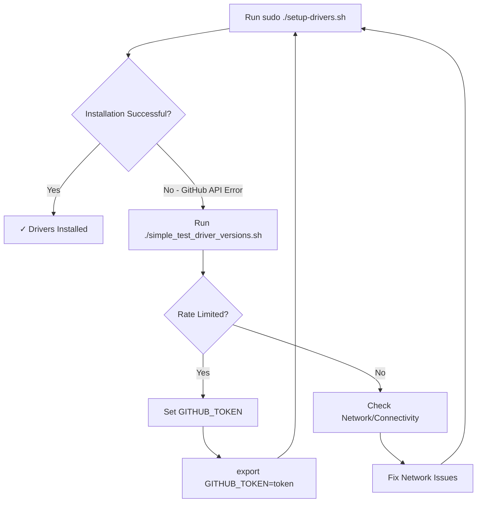

# Intel AI PC Linux Setup

This repository contains scripts to set up Intel GPU and NPU drivers on Ubuntu 24.04 for AI PC platforms.

## Overview

The setup consists of two main scripts:
- **`setup-drivers.sh`**: Main driver installation script (requires root privileges)
- **`verify_connectivity_driver_versions.sh`**: Diagnostic tool for troubleshooting GitHub API connectivity issues
- **`verify_latest_driver_names.sh`**: Tool to inspect available driver assets and verify naming patterns

## Quick Start

### 1. Run the Installation

```bash
sudo ./setup-drivers.sh
```

### 2. If Installation Fails Due to Download Issues

The script will display a troubleshooting message:
```
Error: Failed to get latest release for intel/intel-graphics-compiler
Troubleshooting: Run './verify_connectivity_driver_versions.sh' to diagnose GitHub API connectivity issues
```

### 3. Run the Diagnostic Tool

```bash
./verify_connectivity_driver_versions.sh
```

### 4. Fix Any Issues

If you encounter GitHub API rate limiting, set a GitHub token:

```bash
export GITHUB_TOKEN=your_personal_access_token_here
```

To get a token:
1. Go to https://github.com/settings/tokens
2. Generate a new token (classic) with minimal permissions
3. Copy the token and export it as shown above

### 5. Retry Installation

```bash
sudo ./setup-drivers.sh
```

## What Gets Installed

The setup script installs the following components:

### Intel GPU Drivers
- Intel Graphics Compiler (IGC)
- Intel Compute Runtime
- OpenCL drivers
- Level Zero drivers

### Intel NPU Drivers
- Intel NPU driver compiler
- Intel NPU firmware
- Intel Level Zero NPU drivers

### Supporting Packages
- Required dependencies (curl, wget, clinfo, etc.)
- Intel GPU repository configuration
- Proper user group permissions (video, render)

## System Requirements

- **OS**: Ubuntu 24.04 LTS
- **Kernel**: 6.8 or newer (recommended for optimal compatibility)
- **Hardware**: Intel AI PC with compatible GPU/NPU
- **Privileges**: Root/sudo access for installation

## Troubleshooting

### Common Issues

#### GitHub API Rate Limiting
**Problem**: Installation fails with rate limit errors
**Solution**: Set GITHUB_TOKEN environment variable
```bash
export GITHUB_TOKEN=your_token_here
sudo -E ./setup-drivers.sh  # -E preserves environment variables
```

#### Network Connectivity
**Problem**: Cannot reach GitHub
**Solution**: Check your internet connection and firewall settings
```bash
# Test basic connectivity
curl https://github.com

# Run full diagnostic
./simple_test_driver_versions.sh
```

#### Permission Issues
**Problem**: Script fails due to insufficient privileges
**Solution**: Run with sudo
```bash
sudo ./setup-drivers.sh
```

### Diagnostic Script Output

The `simple_test_driver_versions.sh` script performs these checks:

1. **HTTPS Connectivity**: Tests connection to github.com
2. **GitHub API Access**: Verifies API accessibility and rate limits
3. **Repository Testing**: Checks latest versions for all required repositories:
   - intel/intel-graphics-compiler
   - intel/compute-runtime
   - intel/linux-npu-driver
   - oneapi-src/level-zero

#### Successful Output Example
```
=== Simple Driver Version Test ===

1. Testing HTTPS connectivity...
   ✓ Can reach github.com via HTTPS
2. Testing GitHub API...
   Using GitHub authentication token
   ✓ GitHub API is accessible

3. Testing specific repositories...

Testing intel/intel-graphics-compiler:
   ✓ Found version: v2.12.5

Testing intel/compute-runtime:
   ✓ Found version: 25.22.33944.8

Testing intel/linux-npu-driver:
   ✓ Found version: v1.17.0

Testing oneapi-src/level-zero:
   ✓ Found version: v1.22.4

Test completed!
```

#### Rate Limited Output Example
```
=== Simple Driver Version Test ===

1. Testing HTTPS connectivity...
   ✓ Can reach github.com via HTTPS
2. Testing GitHub API...
   ✗ GitHub API rate limit exceeded

   To fix this issue:
   1. Set your GitHub token: export GITHUB_TOKEN=your_token_here
   2. Get a token at: https://github.com/settings/tokens
   3. Re-run this script
```

## Installation Workflow



## File Structure

```
ai_pc_linux_setup/
├── README.md                        # This file
├── setup-drivers.sh                 # Main installation script
├── simple_test_driver_versions.sh   # Diagnostic tool
├── setup-software.sh                # Software setup (separate)
└── LICENSE                          # License information
```

## Advanced Usage

### Environment Variables

- **`GITHUB_TOKEN`**: Personal access token for GitHub API (recommended)
- **`OS_ID`**: Target OS identifier (default: "ubuntu")
- **`OS_VERSION`**: Target OS version (default: "24.04")

### Manual Package Selection

The script automatically downloads the latest versions, but you can check what versions would be installed:

```bash
./simple_test_driver_versions.sh
```

## Contributing

When contributing to this project:

1. Test changes with the diagnostic script first
2. Ensure compatibility with Ubuntu 24.04
3. Update documentation for any new features
4. Follow the existing error handling patterns

## License

Copyright (C) 2025 Intel Corporation
SPDX-License-Identifier: Apache-2.0
