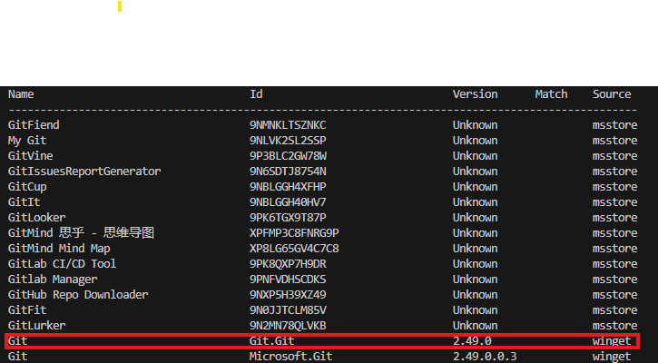

# AIPC Application Installer Version v2.0

## Introduction

Welcome to the AIPC Application Installer. This application is specifically designed to facilitate the setup of development tools, apps and environments for the Intel AIPC Developer engagements and events. It leverages the Microsoft package manager, winget, and can also download external applications using curl with additional configuration.

**New in v2.0:**
- **Interactive GUI Mode**: Windows Forms interface for visual package selection and installation
- **Integrated Uninstall GUI**: Visual interface for uninstalling previously installed packages
- **Enhanced JSON Structure**: Improved package descriptions with friendly names and summaries
- **Advanced Exit Code Handling**: Robust error detection and handling for both install and uninstall operations
- **Automatic Administrator Privileges**: Smart detection and elevation requests for all operations
- **Real-time Package Tracking**: Automatic tracking of installed packages for future uninstallation
- **Backward Compatibility**: Works with both new and legacy JSON formats

For any assistance, please refer to the support documentation or contact our technical support team.

## Options Internal vs External

Internal Mode

- Silent Operation: In internal mode, the script runs silently in the background, automatically accepting all license agreements.
  Module Installation: Installs the PowerShell module WingetClient and updates winget to the latest version 1.10.390.

External Mode
-Silent Operation but with User Interaction: In external mode, users must manually accept pop-up agreements before utilizing the application.

## How to run script

### Pre-requisites
- **Administrator Privileges**: The script will automatically check and request administrator privileges when needed
- **PowerShell Execution Policy**: Set to Unrestricted (the script will guide you)
- **Winget**: Must be installed with version 1.10.X or higher

### Step 1: Set Execution Policy
```powershell
Set-ExecutionPolicy -ExecutionPolicy Unrestricted LocalMachine
```

### Step 2: Verify Winget Installation
Check winget version: `winget --version`

If not installed or outdated, execute:
```powershell
Install-Module -Name Microsoft.WinGet.Client
Repair-WinGetPackageManager -Force -Latest
```
Ensure you have the latest version `1.10.X`

### Usage Options

#### GUI Mode (Recommended for Interactive Use)
```powershell
.\Env_Setup.ps1 gui
```
- Provides a Windows Forms interface for package selection
- Shows package details including friendly names and descriptions
- Interactive installation with progress feedback
- **Integrated uninstall functionality** - uninstall previously installed packages through the same interface
- Main menu with "Install Software" and "Uninstall Software" options
- Automatic administrator privilege checking and elevation

#### Command Line Install Mode
```powershell
.\Env_Setup.ps1 install
```
- Installs all packages from the JSON configuration file
- Runs silently in the background
- Enhanced exit code handling for reliable installation detection
- For every application installed, a corresponding entry is created in `JSON\uninstall\uninstall.json`

#### Command Line Uninstall Mode
```powershell
.\Env_Setup.ps1 uninstall
```
- Removes all previously installed packages using the uninstall.json tracking file
- Enhanced exit code handling recognizes already-uninstalled packages as successful
- Automatically cleans up tracking data after successful uninstallation

## JSON Structure

The installer uses an enhanced JSON format in `applications.json` that includes friendly names and descriptions for better user experience.

### Enhanced JSON Format (applications.json)

#### Global Install Flags

- `global_install_flags`: Default flags applied to all winget installations
  - `--silent`: Runs in background without user interaction
  - `--accept-package-agreements` and `--accept-source-agreements`: Auto-accepts license agreements
  - `--disable-interactivity`: Prevents UAC pop-ups during scheduled tasks
  - `--force`: Ensures installation completion

#### Winget Applications (Enhanced Format)

```json
{
  "id": "Microsoft.VisualStudioCode",
  "friendly_name": "Visual Studio Code",
  "summary": "Code editor",
  "override_flags": null,
  "install_location": null,
  "version": "1.100.2",
  "version_check": "code --version",
  "dependencies": [
    {
      "name": "Git",
      "version": "2.40.0"
    }
  ],
  "skip_install": "no"
}
```

**Enhanced Fields:**
- `id`: Package identifier for winget (replaces `name`)
- `friendly_name`: Human-readable application name
- `summary`: Brief description of the application
- `override_flags`: Custom installation flags (optional)
- `install_location`: Custom installation path (optional)
- `version`: Specific version to install (optional)
- `version_check`: Command to verify installation (optional)
- `dependencies`: Required applications (optional)
- `skip_install`: Controls whether the application should be installed in non-GUI mode (values: "yes" or "no", default is "no")

#### External Applications (Enhanced Format)

```json
{
  "name": "one_api_base_toolkit",
  "friendly_name": "Intel oneAPI Base Toolkit",
  "summary": "Intel's comprehensive suite of development tools",
  "source": "https://download.intel.com/installer.exe",
  "install_flags": "-a --silent --eula accept",
  "download_location": ".\\One_API",
  "uninstall_command": "C:\\Program Files (x86)\\Intel\\oneAPI\\Installer\\installer.exe -s --action remove",
  "dependencies": [
    {
      "name": "Microsoft.VisualStudio.2022.Community",
      "version": "1.100.2"
    }
  ],
  "skip_install": "yes"
}
```

**External Application Fields:**
- `name`: Internal identifier
- `friendly_name`: Display name for users
- `summary`: Application description
- `source`: Download URL
- `install_flags`: Installation command arguments
- `download_location`: Local download directory
- `uninstall_command`: Command for removal
- `dependencies`: Required applications
- `skip_install`: Controls whether the application should be installed in non-GUI mode (values: "yes" or "no", default is "no")

### Installation Notes

- **Installation Order**: The installation process executes from top to bottom. Place external applications and items with dependencies last to ensure required software is installed first.
- **OneAPI Base Toolkit**: Requires specific dependencies including Visual Studio Community and .NET/C++ frameworks. The uninstall command is typically:
  ```
  C:\Program Files (x86)\Intel\oneAPI\Installer\installer.exe -s --action remove --product-id intel.oneapi.win.basekit.product --product-ver 2025.0.1+44
  ```
- **Finding Product Versions**: Execute `.\installer.exe --list-products` to find specific product versions.

## Workflow Overview

### GUI Mode Workflow
1. **Administrator Check**: Automatically verifies and requests admin privileges
2. **Prerequisites Validation**: Checks winget availability and version
3. **EULA Acceptance**: Handles license agreements (if in external mode)
4. **Main Menu Interface**: Choose between "Install Software" and "Uninstall Software"
5. **Package Selection Interface**: 
   - **Install**: Displays interactive grid with available packages and details
   - **Uninstall**: Shows previously installed packages available for removal
6. **Operation Execution**: Installs or uninstalls selected packages with real-time feedback
7. **Smart Result Handling**: 
   - **Install**: Creates uninstall.json entries for successful installations
   - **Uninstall**: Removes entries from uninstall.json for successful uninstallations
   - **Exit Code Intelligence**: Recognizes various success conditions (e.g., already installed/uninstalled)
8. **Result Summary**: Displays detailed success/failure information

### Command Line Mode Workflow
1. **Administrator Privileges Check**: Verifies admin access
2. **Execution Policy Setting**: Sets policy to Unrestricted
3. **Application List Reading**: Reads from applications.json
4. **Log Directory Initialization**: Prepares logging environment
5. **Dependency Resolution**: Validates application dependencies
6. **Installation and Logging**: Installs applications and logs the process
7. **Uninstall JSON Creation**: Generates tracking file for installed applications

## Enhanced Features in v2.0

### Intelligent Exit Code Handling
The installer now features advanced exit code interpretation:

#### Installation Exit Codes
- **0**: Successful installation
- **-1978335212**: Already installed (treated as success)
- **-1978335209**: Version not found (treated as failure)
- **-1978335210**: Package not found (treated as failure)

#### Uninstall Exit Codes
- **0**: Successfully uninstalled
- **1**: Package not found (treated as success - goal achieved)
- **-1978335212**: Package not in installed list (treated as success - already uninstalled)
- **-1978335210**: Package not found (treated as success - goal achieved)

### Automatic Package Tracking
- **Real-time Tracking**: Applications are tracked in `uninstall.json` immediately upon successful installation
- **Smart Cleanup**: Successfully uninstalled applications are automatically removed from tracking
- **Duplicate Prevention**: Prevents duplicate entries in tracking files
- **Robust JSON Handling**: Maintains proper array structure and prevents null values

### Enhanced User Experience
- **Unified Interface**: Single GUI provides both installation and uninstallation capabilities
- **Clear Feedback**: Detailed success/failure messages with specific exit code information
- **Progress Indication**: Real-time feedback during operations
- **Error Recovery**: Graceful handling of various error conditions

## Configuration Files

### Primary Configuration
- **applications.json**: Enhanced format with friendly names and descriptions

### Generated Files
- **uninstall.json**: Tracks installed applications for removal
- **install_log.txt**: Detailed installation logging
- **error_log.txt**: Error tracking and debugging

## Adding New Applications

To add an application to the installer, follow these steps:

### For Winget Applications

1. **Search for the application**:
   ```powershell
   winget search "application name"
   ```
   

2. **Note the Package ID and Version** from the search results

3. **Add to applications.json**:
   ```json
   {
     "id": "Publisher.ApplicationName",
     "friendly_name": "User-Friendly Application Name",
     "summary": "Brief description of what this application does",
     "override_flags": null,
     "install_location": null,
     "version": "1.0.0",
     "version_check": "app --version",
     "dependencies": null
   }
   ```

### For External Applications

1. **Add to the external_applications array**:
   ```json
   {
     "name": "application_internal_name",
     "friendly_name": "Application Display Name",
     "summary": "Description of the application",
     "source": "https://download.url/installer.exe",
     "install_flags": "--silent --accept-eula",
     "download_location": ".\\Downloads\\AppName",
     "uninstall_command": "C:\\Path\\To\\uninstaller.exe --silent",
     "dependencies": []
   }
   ```

### Guidelines for Requesting New Applications

Please follow the CCB process guidelines. Contact:
- Ram (vaithi.s.ramadoss@intel.com) 
- Vijay (vijay.chandrashekar@intel.com)

For more details on JSON schema, view the documentation in the [JSON directory](./Public/JSON/README.md).

## Known Issues

- **Uninstall Limitations**: Clink and Microsoft Visual Studio Installer do not support silent uninstallation - user interaction may be required
- **Vendor Dependencies**: Some uninstall issues depend on software vendor patches and are not controllable by this installer
- **Already Uninstalled Packages**: If packages are uninstalled outside of this tool, they may still appear in the uninstall GUI until explicitly "uninstalled" through the interface (which will then recognize they're already gone and remove them from tracking)
- **Non-Blocking**: These issues do not hamper the core functionality of the installer

## Troubleshooting

### Common Issues and Solutions

#### "Package not found" during uninstall
- **Cause**: Package was already uninstalled by another method
- **Solution**: The system will recognize this as success and remove it from tracking

#### GUI doesn't show any packages for uninstall
- **Cause**: No packages have been installed through this system, or uninstall.json doesn't exist
- **Solution**: Install packages through this tool first, or check if uninstall.json exists in the json/uninstall directory

#### Script hangs on startup
- **Cause**: Administrator privilege dialog waiting for user response
- **Solution**: Check for UAC dialog and respond appropriately

#### Installation shows as failed but package is installed
- **Cause**: Unexpected exit code from winget
- **Solution**: Check the logs for specific exit codes and verify if package is actually installed

## Support

For technical assistance or feature requests, contact our technical support team or refer to the support documentation included with this package.
