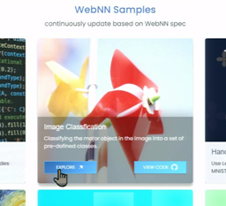

# First-time setup
* Download the Google Chrome Canary for Windows 11 installer from https://www.google.com/chrome/canary/.  
  Run the downloaded file, "ChromeSetup.exe", to download and install Google Chrome Canary.

* Navigate to the “chrome://flags” page.

* Find “Enables WebNN API” and set it to "Enabled", then click "Relaunch"

     
   

# Demo Instructions

1. Open a command shell and enter the following commands to start a local server
   > cd C:\intel\webnn-samples  
   > python -m http.server -b 127.0.0.1 8000  

   _If a Windows security prompt appears, click Allow_

2. Go to the Google Chrome Canary browser window.  
Use the Windows start menu to launch Google Chrome Canary if it is not already running.

3. In the browser's URL bar, type ```http://127.0.0.1:8000``` and press the Enter key.

4. Move the mouse over "Image Classification" and click "Explore".  


5. Select Backend:WebNN and Model:SqueezeNet  

